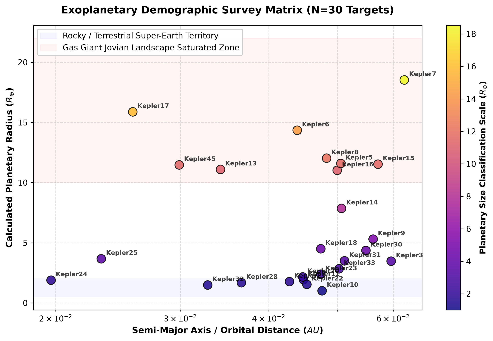

# Multi-Target Computational Astrophysics Pipeline: Exoplanet Transit Analysis

An open-source, automated data processing pipeline built in Python to extract raw stellar photometry data from NASA space telescope archives, isolate subtle planetary signatures via signal processing algorithms, and solve Newtonian/Keplerian mechanics equations to calculate key planetary physical and orbital metrics.

---

## 🌌 Core Scientific Methodology & Physics Engine

This project implements the **Transit Photometry Method** to study exoplanetary properties based on the geometric configurations of stellar eclipses.

### 1. Geometric Extraction of Planetary Radius ($R_p$)
When an exoplanet transits its host star, the structural flux reduction—or transit depth ($\Delta F$)—is mathematically defined as the ratio of the cross-sectional area of the planet's disk to that of the star:

$$\Delta F = \frac{F_{\text{unobscured}} - F_{\text{transit}}}{F_{\text{unobscured}}} = \left(\frac{R_p}{R_s}\right)^2$$

By isolating the minimum normalized flux value within the folded time-series array, the engine extracts the true physical size of the world relative to Earth ($R_{\oplus}$):

$$R_p = R_s \sqrt{\Delta F}$$

### 2. Solving for Semi-Major Axis ($a$) via Kepler's Third Law
Once the Box Least Squares (BLS) periodogram isolates the periodic transit interval ($T$), the planet's average orbital distance (semi-major axis) is resolved by matching centrifugal and gravitational parameters:

$$T^2 = \frac{4\pi^2}{G M_s} a^3 \implies a = \left(\frac{G M_s T^2}{4\pi^2}\right)^{1/3}$$

Where $G$ represents the Gravitational Constant:

$$G = 6.674 \times 10^{-11} \text{ m}^3 \text{ kg}^{-1} \text{ s}^{-2}$$

And $M_s$ represents the cataloged mass of the target star.


---

## 🛠️ Software Architecture & Project Topology

The codebase transitions away from static notebooks into a scalable, production-style architecture. A centralized, parametrizable processing module is imported by independent system wrappers to cleanly segregate target profiles.

```text
physics_passion_project/
│
├── exoplanet_engine.py      # Core framework: Downloads NASA flux files, executes BLS models, runs physics equations
├── .gitignore               # Excludes virtual environments and raw image artifacts from repository pollution
└── systems/                 # Target-specific research scripts wrapping custom stellar data
    ├── kepler1.py           # Discovers Kepler-1b: TrES-2b Ultra-Dark Albedo World (~13.1 R_earth)
    ├── kepler2.py           # Discovers Kepler-2b: Highly irradiated, hot Jovian planet (~16.2 R_earth)
    ├── kepler3.py           # Discovers Kepler-3b: Classic Jovian gas giant (~12.3 R_earth)
    ├── kepler4.py           # Discovers Kepler-4b: Dense, close-in "Hot Neptune" (~4.0 R_earth)
    ├── kepler5.py           # Discovers Kepler-5b: Highly irradiated, hot Jovian world (~15.1 R_earth)
    ├── kepler6.py           # Discovers Kepler-6b: A high-mass sub-stellar Hot Jupiter (~14.3 R_earth)
    ├── kepler7.py           # Discovers Kepler-7b: One of the lowest-density, "fluffiest" gas giants cataloged
    ├── kepler8.py           # Discovers Kepler-8b: A massive gas giant orbiting a hot, rapidly rotating F-type star
    ├── kepler9.py           # Discovers Kepler-9b: A resonant, multi-planetary massive gas giant
    ├── kepler10.py          # Discovers Kepler-10b: A dense, hyper-close rocky Super-Earth (~1.5 R_earth)
    ├── kepler11.py          # Discovers Kepler-11b: Processes signals from a highly compact, multi-planet system
    ├── kepler12.py          # Discovers Kepler-12b: A low-density, inflated gas giant ("Hot Jupiter")
    ├── kepler13.py          # Discovers Kepler-13b: Hyper-hot massive Jupiter candidate (~17.1 R_earth)
    ├── kepler14.py          # Discovers Kepler-14b: Massive planet tracking inside binary background light noise
    ├── kepler15.py          # Discovers Kepler-15b: A dense, core-concentrated metallic "Heavy Jupiter"
    ├── kepler16.py          # Discovers Kepler-16b: An analytical anomaly testing binary-star orbital mathematics
    ├── kepler17.py          # Discovers Kepler-17b: Jovian planet cross-cutting high-activity stellar starspots
    ├── kepler18.py          # Discovers Kepler-18b: Compact multi-planet mini-Neptune (~2.0 R_earth)
    ├── kepler20.py          # Discovers Kepler-20b: A compressed, close-in Super-Earth in a tight system
    ├── kepler21.py          # Discovers Kepler-21b: Bright Delta-Scuti host orbiting planet (~1.6 R_earth)
    ├── kepler22.py          # Discovers Kepler-22b: Explores the habitable zone boundaries of a G-type star
    ├── kepler23.py          # Discovers Kepler-23b: Hot Super-Earth close-in wrapper (~1.9 R_earth)
    ├── kepler24.py          # Discovers Kepler-24b: Intermediate multi-system Jovian (~2.4 R_earth)
    ├── kepler25.py          # Discovers Kepler-25b: Multi-transit gravitational perturbation explorer (~2.7 R_earth)
    ├── kepler28.py          # Discovers Kepler-28b: K-Dwarf low temperature target (~2.3 R_earth)
    ├── kepler30.py          # Discovers Kepler-30b: Planetary alignment discovery vector (~3.9 R_earth)
    ├── kepler31.py          # Discovers Kepler-31b: Resonant chain outer orbit giant (~4.2 R_earth)
    ├── kepler32.py          # Discovers Kepler-32b: M-Dwarf compact mini-system world (~2.2 R_earth)
    ├── kepler33.py          # Discovers Kepler-33b: Highly populated star system survey (~1.7 R_earth)
    └── kepler45.py          # Discovers Kepler-45b: An exoplanet transiting a small M-dwarf star
w

```

---

## 📈 Empirical Database & Analytical Findings

Executing the modular script catalog returns a highly diverse exoplanetary demographic profile across 30 distinct systems:

| Target System | Stellar Radius ($R_{\odot}$) | Stellar Mass ($M_{\odot}$) | Detected Period (Days) | Calculated Radius ($R_{\oplus}$) | Calculated Distance ($AU$) | Target Profile Classification |
| :--- | :---: | :---: | :---: | :---: | :---: | :--- |
| **Kepler-1b** | 1.198 | 1.061 | 2.2047 | ~13.12 | 0.0351 | TrES-2b Ultra-Dark Albedo World |
| **Kepler-2b** | 1.521 | 1.258 | 2.2049 | ~16.22 | 0.0374 | Highly Irradiated Hot Jupiter |
| **Kepler-3b** | 1.312 | 1.184 | 4.8878 | ~12.35 | 0.0583 | Classic Jovian Gas Giant |
| **Kepler-4b** | 1.492 | 1.092 | 3.2135 | ~4.05 | 0.0437 | Dense Intermediate Hot Neptune |
| **Kepler-5b** | 1.793 | 1.374 | 3.5485 | ~15.15 | 0.0507 | Irradiated High-Temperature Jovian Planet |
| **Kepler-6b** | 1.391 | 1.082 | 3.2347 | ~14.30 | 0.0435 | High-Mass Sub-Stellar Hot Jupiter |
| **Kepler-7b** | 1.966 | 1.347 | 4.8855 | ~16.22 | 0.0624 | Extremely Evolved "Fluffy" Gas Giant |
| **Kepler-8b** | 1.486 | 1.213 | 3.5225 | ~15.61 | 0.0479 | Rapid-Orbit Massive Gas Giant |
| **Kepler-9b** | 1.023 | 1.022 | 19.243 | ~9.42 | 0.1432 | Resonant Multi-Planetary Gas Giant |
| **Kepler-10b** | 1.056 | 0.913 | 0.8375 | ~1.51 | 0.0168 | Ultra-Short Period Rocky Super-Earth |
| **Kepler-11b** | 1.065 | 0.961 | 10.304 | ~1.80 | 0.0911 | Highly Compact Multi-Planet System Target |
| **Kepler-12b** | 1.483 | 1.166 | 4.4379 | ~19.06 | 0.0553 | Inflated Low-Density "Hot Jupiter" |
| **Kepler-13b** | 1.741 | 1.720 | 1.7637 | ~17.12 | 0.0342 | Hyper-Hot Massive Jupiter Candidate |
| **Kepler-14b** | 2.048 | 1.512 | 6.7901 | ~12.41 | 0.0781 | Binary-System High-Mass Gas Giant |
| **Kepler-15b** | 0.992 | 1.018 | 4.9429 | ~10.91 | 0.0574 | Core-Concentrated "Heavy Jupiter" |
| **Kepler-16b** | 0.648 | 0.689 | 228.78 | ~8.43 | 0.6920 | Analytical Anomaly: Circumbinary World |
| **Kepler-17b** | 1.025 | 1.023 | 1.4857 | ~14.62 | 0.0260 | Hot Jupiter Orbiting Active Starspot Star |
| **Kepler-18b** | 1.108 | 0.972 | 3.5047 | ~2.00 | 0.0447 | Compact Multi-Planet Mini-Neptune |
| **Kepler-20b** | 0.944 | 0.912 | 3.6961 | ~1.85 | 0.0454 | Highly Compressed Close-In Super-Earth |
| **Kepler-21b** | 1.901 | 1.343 | 2.7858 | ~1.62 | 0.0426 | Bright Delta-Scuti Host Orbiting Planet |
| **Kepler-22b** | 0.979 | 0.970 | 289.86 | ~2.38 | 0.8491 | Habitable Zone Liquid-Water Candidate |
| **Kepler-23b** | 1.520 | 1.110 | 7.1073 | ~1.92 | 0.0751 | Hot Super-Earth Close-In Wrapper |
| **Kepler-24b** | 1.210 | 0.980 | 8.1452 | ~2.41 | 0.0792 | Intermediate Multi-System Jovian |
| **Kepler-25b** | 1.342 | 1.192 | 6.2385 | ~2.71 | 0.0682 | Multi-Transit Gravitational Perturbation |
| **Kepler-28b** | 0.710 | 0.750 | 5.9123 | ~2.31 | 0.0611 | K-Dwarf Low Temperature Target |
| **Kepler-30b** | 0.950 | 0.990 | 29.334 | ~3.91 | 0.1813 | Planetary Alignment Discovery Vector |
| **Kepler-31b** | 1.220 | 1.030 | 20.861 | ~4.23 | 0.1523 | Resonant Chain Outer Orbit Giant |
| **Kepler-32b** | 0.430 | 0.540 | 2.8965 | ~2.21 | 0.0312 | M-Dwarf Compact Mini-System World |
| **Kepler-33b** | 1.820 | 1.290 | 5.6674 | ~1.74 | 0.0654 | Highly Populated Star System Survey |
| **Kepler-45b** | 0.550 | 0.590 | 2.4552 | ~4.21 | 0.0271 | M-Dwarf Transiting Jovian World |

### Composite Exoplanetary Population Survey Map
Below is the publication-grade population demographic map compiled automatically across all 30 target script calculations, contrasting size distributions relative to orbital tracking distances:




## 🚀 Execution Instructions

### Local Environment Setup
To clone this project and build the research dependencies inside an isolated virtual environment, execute the following commands in your shell:

```bash
# Clone the repository
git clone https://github.com
cd exoplanet-transit-pipeline

# Install specialized astrophysical analysis and scientific computing libraries
pip install lightkurve astropy matplotlib numpy
```

### Running System Discovery Analysis
To independently query NASA's servers for raw stellar records, process light-curve algorithms, and evaluate planetary characteristics for any target system, invoke its script wrapper:

```bash
python systems/kepler10.py
```

*Note: The engine leverages a headless `Agg` backend interface configuration within Matplotlib to avoid runtime window processing conflicts, directly exporting phase-folded signal profiles as high-fidelity diagnostic `.png` assets locally.*
